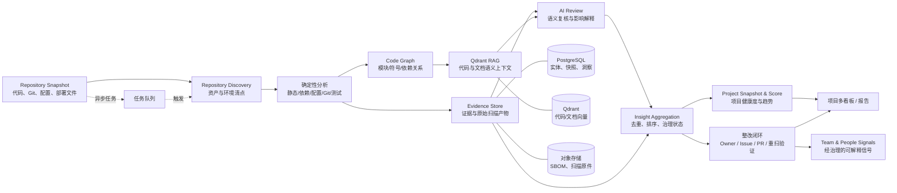

# DevLens 项目评估与 AI Review 架构设计

> 文档状态：目标架构
> 适用范围：Project Intelligence、仓库分析、AI Review、项目治理闭环
> 关联文档：[DevLens MVP 主提示词](../prompts/devlens-mvp-prompt.md) · [提示词使用指南](../prompts/使用指南.md)

## 1. 定位与边界

DevLens 的核心价值链为：

```text
Code → Semantic → Behavior → Skill → Organization
```

其中“项目（Project）— 团队（Team）— 人员（People）”三位一体并非三个孤立的看板：

- **项目**回答：项目是否健康、风险在哪里、为什么发生、如何验证改善；
- **团队**回答：团队是否具备处理项目风险的能力、协作和 Owner 覆盖是否可靠；
- **人员**回答：成员在经过治理、可解释的工程事实中承担了什么角色、形成了哪些能力信号。

Project Intelligence 是三者的事实底座。它将仓库、配置、依赖、部署资产、代码图谱、Git 演化和分析结果转化为可追溯的项目健康快照。

AI Review 是其中一类**证据生产能力**，不是只有几张“AI 建议卡片”的独立功能。它应与静态分析、依赖分析、配置扫描、测试信号和 Git 事实共同构成判断依据。

### 1.1 项目评估的非目标

- 不以 LLM 的自然语言结论作为唯一评分依据；
- 不保存或展示配置中的明文密钥、Token、密码、私钥等敏感值；
- 不将未经证据化、去重和治理的风险直接转为个人绩效结论；
- 不承诺替代人工安全审计、业务验收、架构评审或生产变更审批。

## 2. 总览架构与数据流



### 2.1 存储职责

| 组件 | 职责 |
| --- | --- |
| PostgreSQL | 项目、分析运行、资产、环境、证据元数据、洞察、整改状态、评分明细与历史快照 |
| Qdrant | 函数/类/文档/配置摘要的向量及可过滤 payload，用于 AI Review 的上下文检索 |
| 对象存储 | 原始扫描报告、SBOM、SARIF、覆盖率报告等大对象；敏感内容按策略加密或不落盘 |
| 任务队列 | 全量分析、增量分析、周期性深度扫描、报告生成与重试隔离 |

### 2.2 与既有八阶段 Pipeline 的衔接

既有 Pipeline 保持八阶段主干，但项目智能在以下阶段深化：

1. **Git 数据采集**：采集提交、blame、变更范围、Revert/Hotfix 等演化信号。
2. **身份匹配**：将 Git 身份映射到组织人员，但保留未匹配和 Bot 身份。
3. **代码解析**：通过 tree-sitter 构建文件、模块、类、函数、import/call/contain 图谱；同时运行仓库发现、依赖和配置解析。
4. **向量化**：以函数/类/模块文档为单元写入 Qdrant，payload 保留版本、路径、符号、作者、提交等可检索元数据。
5. **个人能力建模**：仅消费可解释、经治理的工程信号。
6. **团队能力聚合**：结合模块 Owner、备份覆盖、Bus Factor 和协作事实。
7. **项目快照**：汇总确定性指标、专项分析和洞察治理状态，写入评分明细、技术资产和趋势。
8. **AI 报告**：调用项目分析 Skill Group，生成带证据引用的摘要；不得以报告文本反向覆盖原始指标。

## 3. 三层项目指标模型

当前“项目健康度”“AI Review 五维”和页面证据卡服务于不同层次，不能混为一套评分。目标模型如下。

### 3.1 项目健康度层

项目健康度采用 0–100 分，每个分项都必须可回溯到原始指标、规则结果和已聚合洞察。

| 健康度领域 | 说明 | 示例信号 |
| --- | --- | --- |
| 代码质量 | 可读性、重复、坏味道、规范一致性 | lint、重复率、Review 结果 |
| 架构与可维护性 | 模块边界、依赖方向、耦合与演进成本 | 环依赖、扇入/扇出、热点模块 |
| 安全与合规 | 漏洞、密钥、依赖风险、配置风险 | SAST、SCA、secret detection |
| 可靠性与韧性 | 错误处理、重试、超时、降级、资源释放 | 异常路径、超时配置、连接复用 |
| 测试与交付 | 测试覆盖、变更保护、CI/CD 质量 | 覆盖率、测试失败、流水线门禁 |
| 活跃度与可持续性 | 演化速度、维护集中度、知识风险 | Git 活跃度、Bus Factor、Owner 覆盖 |
| 技术债治理 | 债务规模、趋势、修复成本和老化程度 | 高复杂度、过期依赖、未处理风险 |
| 配置与运行风险 | 环境、部署、基础设施配置的完整性与安全性 | 环境差异、权限、资源限制 |

### 3.2 专项分析层

专项分析以“发现、证据、置信度、影响和建议”为核心，可覆盖：

- 安全；
- 性能；
- 逻辑正确性与漏洞；
- 复杂度与技术债；
- 代码风格、规范与可维护性；
- 鲁棒性、异常处理与可靠性；
- 高内聚低耦合与架构演进；
- 配置、依赖、环境与部署；
- 测试与交付质量；
- Git 演化、Owner、Bus Factor 与风险归属。

专项结果可以影响健康度领域，但必须记录映射关系、权重和评分版本。

### 3.3 呈现与治理层

页面和报告以治理行动为中心，呈现：健康度总览、风险热力、趋势、可跳转证据、整改优先级、Owner/备份覆盖、团队能力关联和分析置信度。

### 3.4 分数、趋势与置信度口径

- **分数**：0–100 浮点数。确定性指标优先；AI 结论只能作为有证据的补充信号，不能单独决定分数。
- **趋势**：与同一评分版本或可转换版本的历史快照比较，展示改善、持平或劣化及变化量。
- **置信度**：0–1 浮点数，反映检测证据完整度、交叉验证结果和 AI 复核一致性；置信度低的结果进入“待确认”，不直接作为高优先级治理项。

## 4. 仓库发现与技术资产清单

Repository Discovery 在 LLM 分析之前运行，以可复现的解析和规则识别项目资产。

### 4.1 识别范围

- 语言、框架、构建工具、包管理器与工作区结构；
- 服务边界、模块、入口、共享库与依赖关系；
- Docker、Docker Compose、Kubernetes、Helm、Terraform、Ansible、Nginx；
- GitHub Actions、GitLab CI、Jenkins 等流水线定义；
- `.env*`、YAML/YML、JSON、TOML、INI、properties、XML 等配置；
- 测试框架、覆盖率配置、质量门禁与文档资产。

### 4.2 配置安全原则

配置扫描输出仅包含路径、键名、类型、环境归属、风险标志、哈希/指纹和必要元数据：

- 不持久化明文密钥、密码、Token、Cookie、私钥或连接字符串中的凭据；
- 传入 LLM 的配置必须经过脱敏和最小化裁剪；
- 支持保留“疑似明文机密”“生产配置缺失”“环境间不一致”等证据，但证据摘要不得暴露值；
- 原始扫描产物受访问控制、加密和保留期限策略约束。

### 4.3 资产清单输出

分析完成后，项目应形成以下可查询资产：

- 技术栈：语言、框架、运行时、构建和包管理器；
- 模块与服务：路径、边界、依赖、Owner、活跃度；
- 依赖与 SBOM：版本、许可证、已知漏洞、直接/间接关系；
- 配置资产：类型、路径、键分类、环境、风险；
- 部署资产：镜像、编排、IaC、CI/CD 和可观测性配置；
- 环境矩阵：环境名称、来源、覆盖关系、确认度和证据。

## 5. 基础设施、中间件与环境识别

中间件识别不能只依据 `package.json`、`pom.xml` 或镜像名称。系统需要综合规则、依赖、配置、部署定义和调用代码，并给出确认等级。

| 资产类别 | 典型目标 |
| --- | --- |
| 缓存与会话 | Redis、Memcached |
| 数据库 | MySQL、PostgreSQL、MongoDB、ClickHouse、Elasticsearch 等 |
| 消息与流式 | Kafka、RabbitMQ、RocketMQ、Pulsar 等 |
| 大数据与湖仓 | Hadoop、HBase、Hive、Spark、Flink、Ozone 等 |
| 对象存储 | OSS、S3、MinIO、COS 等 |
| 可观测性 | Prometheus、Grafana、OpenTelemetry、Sentry 等 |
| 外部服务 | 支付、短信、邮件、身份、地图、AI 服务等 |

### 5.1 确认等级

- **确认使用**：至少存在运行配置/部署定义或调用代码，并与依赖、命名或连接信息交叉印证；
- **疑似引用**：存在多项弱信号，但缺少可执行调用或环境配置；
- **仅依赖存在**：仅从依赖清单发现，不应判断为实际运行资产。

### 5.2 环境识别

识别 `local`、`development`、`test`、`staging`、`canary`、`production` 等环境，以文件命名、目录、变量覆盖、Helm values、Kubernetes namespace、CI/CD stage 和部署脚本建立证据关联。环境结论必须同时包含来源和确认等级。

## 6. 项目分析 Skill Group

每个 Skill Group 是可独立编排、可增量运行的分析单元。其通用输出契约为：`analysis_run_id`、目标范围、证据集合、指标、洞察候选、置信度、规则/模型版本与失败信息。

| Skill Group | 检测对象与确定性信号 | AI 复核上下文 | 主要产出 | 增量触发与三位一体关联 |
| --- | --- | --- | --- | --- |
| 1. 仓库发现与资产清点 | 清单、目录、配置、部署文件 | 项目结构摘要 | 技术/配置/部署资产清单 | 配置或清单变更；为项目画像提供底座 |
| 2. 代码图谱、模块边界与依赖 | AST、import/call、环依赖、扇入扇出 | 相邻模块、调用链 | 模块图、热点与边界风险 | 代码变更；映射模块 Owner 与团队覆盖 |
| 3. 安全审计 | SAST、SCA/SBOM、secret、权限与配置 | 漏洞附近代码、调用方、修复历史 | 安全证据与风险候选 | 依赖/敏感代码变更；只将已治理信号用于人员侧 |
| 4. 性能风险分析 | N+1、低效循环、阻塞 I/O、缓存/连接使用 | 调用链、数据量线索、配置 | 性能热点与优化建议 | 热点模块或配置变更；关联模块责任与容量能力 |
| 5. 逻辑正确性与漏洞 | 不变式破坏、边界条件、鉴权流程、状态机 | 测试、调用方、历史缺陷 | 正确性风险与待确认项 | PR/核心逻辑变更；关联 Review 和修复归属 |
| 6. 复杂度与技术债 | 圈复杂度、认知复杂度、重复、超大文件、老化 | 模块依赖和变更历史 | 债务清单、趋势、重构候选 | 文件/模块变更；关联维护集中度 |
| 7. 代码风格、规范与可维护性 | lint、命名、API 约定、文档缺失 | 同仓库约定、相邻实现 | 规范偏差和维护建议 | 源码变更；用于质量趋势，不孤立评价个人 |
| 8. 鲁棒性与可靠性 | 异常处理、超时、重试、熔断、资源释放 | 外部调用链、运行配置、测试 | 可靠性风险与验证建议 | I/O 或运行配置变更；关联生产风险覆盖 |
| 9. 高内聚低耦合与架构演进 | 模块边界、反向依赖、共享可变状态 | 图谱、领域目录、变更耦合 | 架构热点和演进路径 | 依赖图变化；关联跨团队协作边界 |
| 10. 配置、依赖、环境与部署 | 环境差异、权限、资源、镜像与 IaC | 脱敏配置、流水线、部署定义 | 运行风险、环境矩阵 | 配置/依赖/部署变更；关联运维能力覆盖 |
| 11. 测试与交付质量 | 覆盖率、测试失败、变更保护、门禁 | 测试代码、CI 结果、变更范围 | 测试缺口与交付风险 | PR/CI 变更；关联质量保障能力 |
| 12. Git 演化、Owner 与风险归属 | blame、活跃度、Revert、Hotfix、集中度 | 模块历史、已有洞察 | Owner、备份、Bus Factor 风险 | 新提交与周期快照；连接项目、团队、人员 |
| 13. AI 复核、洞察聚合与优先级 | 候选洞察、证据指纹、规则结果 | RAG 检索的最小必要上下文 | 去重洞察、摘要、行动建议 | 所有上游产出；驱动治理闭环 |

安全审计必须组合 SAST、依赖/SBOM、secret detection、配置安全与 AI 语义复核。AI 负责上下文判别、影响分析和解释，不替代确定性扫描器。

## 7. AI Review 深化设计

### 7.1 审查范围

| 范围 | 目的 | 典型触发 |
| --- | --- | --- |
| PR / 提交级 | 在变更进入主干前发现增量风险 | PR、commit、代码审查请求 |
| 文件 / 模块级 | 聚焦热点模块、关键路径和重构区域 | 热点、复杂度阈值、规则命中 |
| 仓库 / 项目级 | 归纳跨模块架构、配置、依赖和治理风险 | 首次全量分析、周期性深度扫描 |

### 7.2 RAG 上下文

LLM 输入仅包含完成判断所需的最小上下文，并记录每段来源：

- 目标代码 chunk 与符号信息；
- 调用方/被调用方和关键依赖链；
- 同模块脱敏配置、测试和接口约定；
- 相关 Git 变更与历史修复；
- 已有洞察与相同规则结果，避免重复；
- 规则工具的原始结论与置信度。

系统需要限制 token 预算、文件数量和敏感数据范围；检索失败或证据不足时，结果应降级为“待确认”。

### 7.3 结构化洞察契约

```json
{
  "id": "insight_uuid",
  "title": "未校验 JWT 算法白名单",
  "category": "security",
  "subcategory": "authentication",
  "severity": "critical",
  "confidence": 0.91,
  "status": "open",
  "scope": "module",
  "location": {
    "path": "services/auth/token.ts",
    "symbol": "verifyToken",
    "start_line": 42,
    "end_line": 58,
    "commit": "abc123"
  },
  "evidence_summary": "验证逻辑接受 token header 提供的算法，未限制允许算法。",
  "sources": ["sast:jwt-algorithm", "rag:chunk_123"],
  "impact": "攻击者可能构造算法降级 token 绕过身份校验。",
  "recommendation": "显式限制允许算法，并添加拒绝非白名单算法的单元测试。",
  "verification": "修复后运行安全规则和新增的算法拒绝测试。",
  "fingerprint": "stable-dedup-fingerprint",
  "linked_fix_id": null,
  "analysis_version": "2026.07"
}
```

类别覆盖 `quality`、`security`、`performance`、`maintainability`，并扩展 `architecture`、`reliability`、`logic`、`complexity`、`configuration`、`dependency`、`testing`、`delivery`。UI 可将其聚合成更少的展示分组，但不能丢失原始类别。

模型输出必须支持 JSON 容错解析，记录模型、Prompt、规则和分析版本；敏感代码遵循最小化传输与审计策略。

## 8. 洞察聚合、多看板与整改闭环

### 8.1 项目详情多看板

项目详情从单列洞察卡演进为以下看板：

1. **健康度与趋势总览**：健康度分解、评分变动、分析覆盖范围与置信度。
2. **风险领域矩阵**：按安全、性能、架构、可靠性、测试、配置等领域展示严重性与趋势。
3. **AI Review 收件箱**：按严重性、类别、模块、环境、状态、来源、置信度筛选，支持查看证据位置。
4. **架构与依赖热点**：模块图、耦合热点、循环依赖、变更集中度和复杂度。
5. **配置与环境资产**：技术栈、中间件、环境矩阵、部署资产、确认等级与风险。
6. **技术债与修复优先级**：债务老化、影响面、工作量、建议修复窗口。
7. **风险覆盖与组织关联**：Owner、备份 Owner、Bus Factor、团队能力缺口和协作边界。

### 8.2 去重与优先级

洞察首先以代码位置、规则标识、配置路径和语义指纹聚类；同一问题在多次扫描或多个检测器中命中时合并证据而非重复展示。

优先级由以下因子组成：严重性、可利用性、影响面、置信度、模块变更活跃度、生产环境关联、Owner/备份覆盖、修复成本与债务老化。计算结果必须保留因子明细，方便人工调整。

### 8.3 整改状态

洞察支持以下状态：

```text
open → acknowledged → in_progress → resolved
                 ├→ accepted_risk
                 └→ false_positive
```

每次状态变更记录责任人、时间、原因、关联 Issue/PR、验证提交和重新扫描结果。只有修复后的规则/测试/重扫结果满足验证条件，才可标记为 `resolved`。

### 8.4 Project → Team → People 闭环

- 项目风险按模块映射 Owner、备份 Owner 和维护集中度；
- 团队视角聚合高风险模块的覆盖度、技能缺口和协作瓶颈；
- 人员画像只使用已经证据化、去重、可解释且完成适当治理的工程信号；
- 单个洞察不直接定义个人能力，持续的模块责任、修复质量、Review 深度和协作贡献才可作为能力建模输入。

## 9. 数据模型、API 与前端演进契约

### 9.1 项目快照元数据

既有 `project_snapshots` 保留 `health_score`、`quality_score`、`security_score`、`tech_debt_score`、`activity_score` 等核心字段；`metadata` 至少应承载：

```json
{
  "score_version": "2026.07",
  "analysis_run_id": "uuid",
  "coverage": { "files": 0, "lines": 0, "languages": [] },
  "score_breakdown": {},
  "specialty_summary": {},
  "insight_counts": { "open": 0, "critical": 0 },
  "asset_summary": { "services": 0, "environments": 0 },
  "evidence_refs": [],
  "confidence": 0.0
}
```

后续应将高频查询和可治理对象从 JSON 中拆分为独立实体：`analysis_runs`、`technology_assets`、`configuration_assets`、`environments`、`analysis_evidence`、`insights`、`insight_status_events`、`remediation_items`、`score_breakdowns`。

### 9.2 前端类型迁移

当前 `AIReviewInsight` 仅表达模块、类型、级别、证据、影响和建议。后续至少扩展：

```text
id / title / category / subcategory / severity / confidence / status /
source / detectedAt / location / fingerprint / linkedFix
```

`FixPriority` 需要通过洞察 ID 关联整改项，不能只以模块名建立弱关联。现有五维证据卡、AI Review 洞察、技术债趋势和修复优先级将演进为上述多看板，由 API 驱动。

> 当前 `frontend/lib/api.ts` 的项目读取仍返回 mock 数据。后续实现本架构时，应将项目列表、详情、洞察、资产和趋势替换为真实 API，不再以 mock 作为运行时默认数据源。

### 9.3 API 目标能力

在既有项目 API 基础上增加或细化：

```text
POST /projects/{id}/analyze                 触发分析，返回分析运行 ID
GET  /projects/{id}/analysis-runs           查询分析运行与阶段状态
GET  /projects/{id}/snapshots               查询评分与趋势
GET  /projects/{id}/assets                  查询技术、配置、部署和环境资产
GET  /projects/{id}/insights                查询洞察，支持筛选与分页
GET  /projects/{id}/insights/{insight_id}   查询证据、来源与关联整改
PATCH /projects/{id}/insights/{insight_id}  更新治理状态/责任人
GET  /projects/{id}/remediations            查询整改优先级与验证状态
GET  /projects/{id}/architecture            查询模块、依赖与热点
```

## 10. 编排、增量策略与质量保障

### 10.1 分析触发策略

| 触发方式 | 范围 | 说明 |
| --- | --- | --- |
| 首次全量 | 全仓库 | 建立资产、图谱、基线快照和初始洞察 |
| 提交/PR 增量 | Diff 与受影响依赖 | 优先运行变更相关 Skill Group，并重算受影响指标 |
| 依赖/配置/部署变更 | 清单、配置、IaC、流水线 | 强制运行 SCA、配置、环境和部署风险分析 |
| 周期性深度扫描 | 全仓库与历史趋势 | 发现慢性技术债、架构漂移、老化风险和 Owner 变化 |

### 10.2 可解释与可靠执行

- 快照、规则、模型、Prompt、评分均带版本，避免趋势跨版本误读；
- 任务可重试、可取消、可超时隔离，单一 Skill Group 失败不阻断可用的部分结果；
- 使用内容哈希、模块依赖和扫描缓存控制成本；
- 分析预算、模型路由和敏感信息策略可按组织/项目配置；
- 对读取仓库、扫描产物和洞察状态实施最小权限控制与审计。

### 10.3 验收标准

1. 每个分数和洞察均能回溯到规则、文件、模块、配置、提交或其他证据。
2. 配置扫描不泄露明文机密，LLM 输入遵循脱敏和最小化原则。
3. 中间件与环境识别展示确认等级和证据来源。
4. 高严重性问题可以被复现、关联整改，并在重扫后验证修复结果。
5. 洞察可去重、可筛选、可追踪状态，评分可解释、趋势可比较。
6. 项目、团队和人员之间只传递经过治理的可解释工程信号。

## 11. 分期落地路线

| 阶段 | 目标 |
| --- | --- |
| P0 | 仓库发现、技术资产清单、基础静态指标、项目快照，以及将现有洞察卡升级为证据化结构 |
| P1 | 安全、性能、复杂度、配置环境 Skill Group；洞察聚合；项目多看板 |
| P2 | 代码图谱与 RAG 深度复核；整改闭环；Project-Team-People 风险关联 |
| P3 | 高质量增量分析、基线比较、规则/模型/Prompt 治理与效果度量 |

## 12. 实施约束摘要

- 规则优先、AI 增强；
- 证据优先、评分可解释；
- 资产与环境是项目运行画像的一部分，不只是 AI Review 问题；
- Skill Group 可按仓库类型、预算和变更范围编排；
- 洞察必须形成责任、修复、验证和重扫的治理闭环。
